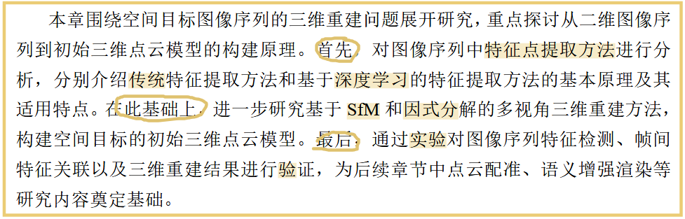
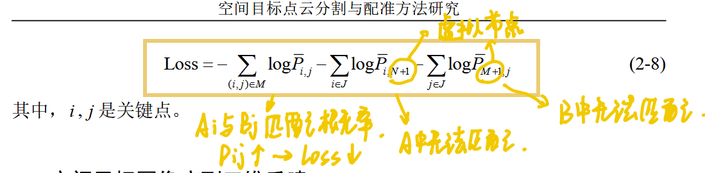
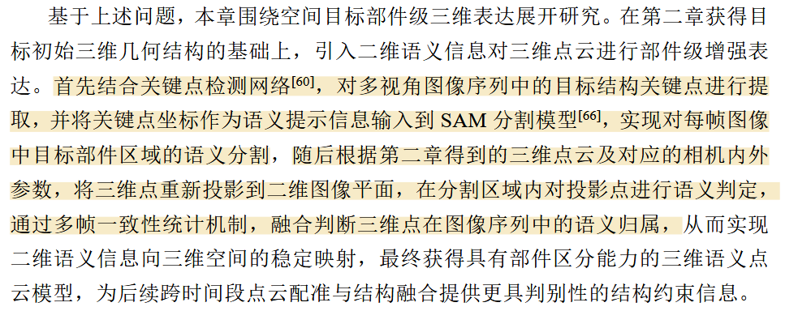
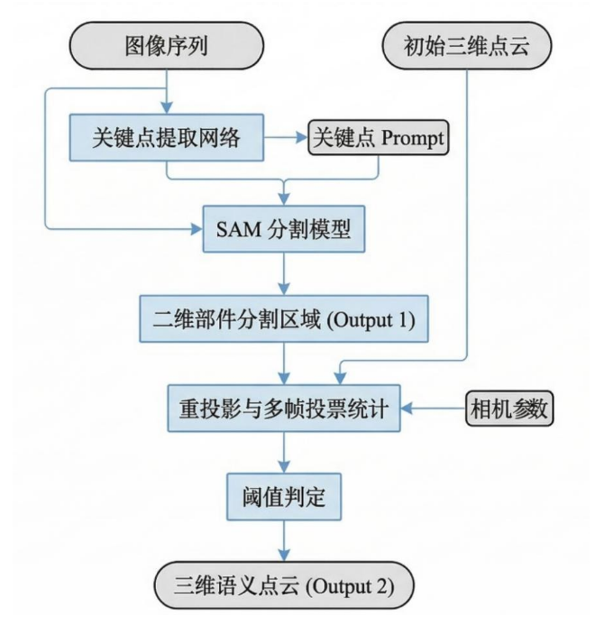
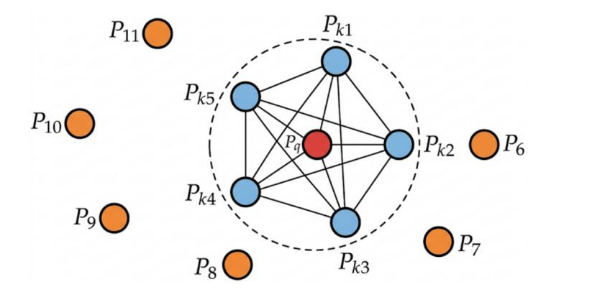
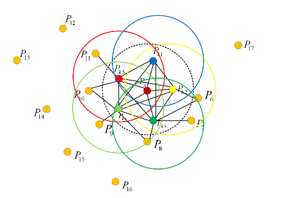
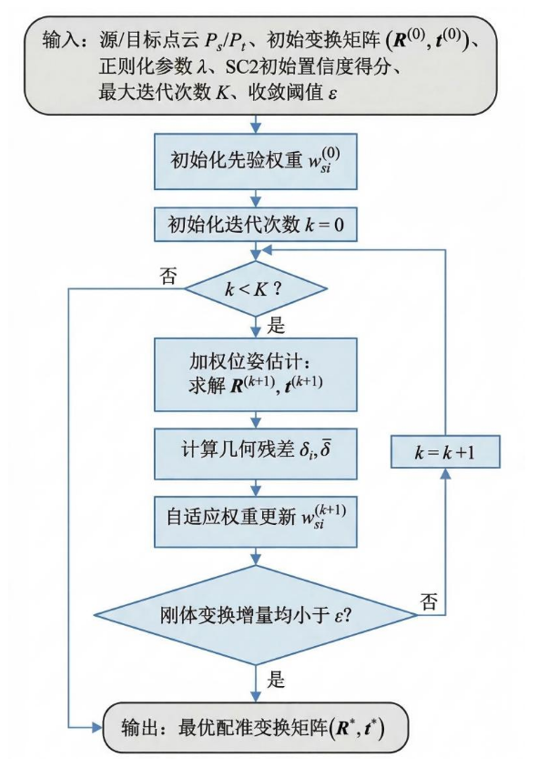

# **题目：空间目标点云分割与配准方法研究**

> **论文类型**：硕士学位论文 **研究对象**：Aura、天宫一号（TG1）等空间目标的光学图像、ISAR 图像及其三维点云 **主线任务**：多视角三维重建 → 部件级语义分割 → 跨时间段点云配准与融合 → 系统平台集成。

## **摘要：**

*   **背景：**近年来,随着空间目标观测技术和计算机视觉技术的发展,利用图像序列对空 间目标进行三维重建已成为空间态势感知与在轨目标分析的重要研究手段，具有广泛应用价值
*   **问题：**实际观测过程中，多视角图像序列重建的三维点云存在结构不完整以及**语义信息缺失**等问题。此外,**不同时段重建**产生的三维点云,空间位置和姿态上存在较大差异,需要通过点云配准统一表达
*   **方法：**从提升点云语义表达与跨时段点云配准精度的角度出发,提出了一 种**关键点引导融合多视角投影投票**的语义分割方法,并引入**图结构置信度加权**机制改进传统配准算法
*   **目的：**旨在解决传统重建方法语义信息缺失及点云配准误差大的实际需求
*   **工作：**（1）针对传统三维重建缺乏语义信息表达的问题,提出一种基于关键点引导 的空间目标三维语义分割方法（2）针对不同时段重建的三维点云,提出了一种基于图结构置信度加权的跨 时间段点云配准方法。（3）可视化平台

## **绪论：**

**1.1 研究背景及意义**

* **背景：**(1)随着信息感知技术和计算机处理能力的提升，对复杂目标和场景进行精细化三维建模已成为多个研究领域的重要发展方向，具有广泛应用价值。

* **核心挑战：**然而,受**观测距离、成像条件以及视角限制**等因素影响，当前对空间目标的感知结果多以**二维图像**形式呈现,这在一定程度上限制了对目标真实空间结构和几何特性的深入理解。

* **目的：**充分挖掘空间目标图像中蕴含的空间信息,实现 从二维图像观测到三维结构表达的有效转换

*   **方法及意义：\*\*\*\*1.多视角：**<u>基于多视角的三维重建可为三维结构恢复提供必要几何约束，但面临诸多挑战</u>。空间目标图像往往存在纹理特征不稳定、局部信息缺失等问题。这些因素使得图像序列中的特征提取、特征匹配以及视角关联过 程面临较大困难**2.点云配准：**<u>高鲁棒性点云配准方法解决三维点云在不同坐标系中姿态和尺度不一</u>**3.三维语义分割**：<u>结合二维语义信息对空间目标结构进行增强表达</u>

**1.2 国内外研究现状**

* 三维重构方法

* 点云分割方法

*   点云配准方法

**1.3 研究内容**

1.<a href="zotero://open/library/items/RTXYRMTG?page=20&#x26;annotation=5WJBQJ7C">“针对多视角空间目标二维图像序列,研究基于特征匹配与多视角几何约 束的三维重建方法”</a>

2.引入基于 SAM(Segment Anything Model)的二维图像语义分割模型，实现空间目标的部件级语义划分。随后,通过相机内外参数将三维点云重新投影至二维图像平面,根 据投影点在二维图像中的分割区域归属,将对应的语义标签传递至三维空间，从而实现三维点云的语义分割与部件标注。

3.本文开展跨时段三维点云配准与融合研究

4.设计并搭建一个基于三维重建与结构融合的多模块用户系统平台

**1.4 **<a href="zotero://open/library/items/RTXYRMTG?page=21"><strong>“本文组织架构”</strong></a>

* 第一章：介绍研究背景、研究现状、研究内容与论文结构。

* 第二章：研究图像特征匹配、因式分解重建与投票投影重建。

* 第三章：利用关键点引导 SAM，并通过多视角投票实现三维部件分割。

* 第四章：采用 TurboReg 粗配准和图置信度加权 ICP 细配准，实现跨时段点云融合。

* 第五章：集成三维重建、语义分割与点云配准模块，开发可视化平台。

*   第六章：总结全文工作并提出未来研究方向。

## ch2 <a href="zotero://open/library/items/RTXYRMTG?page=23">“基于空间目标图像的三维重建原理”</a>

**2.1 引言**

**2.2 **<a href="zotero://open/library/items/RTXYRMTG?page=24"><strong>“图像序列特征点提取和匹配”</strong></a>

<a href="zotero://open/library/items/RTXYRMTG?page=24&#x26;annotation=ERDX4Z7D"><strong>“基于 SIFT 的传统特征提取原理”</strong></a>

输入图像→尺度空间极值检测→关键点定位→方向分配→特征描述子生成→特征匹配

SILF首先通过构建高斯尺度空间对原始图像进行多尺度表示，利用高斯差分DoG来拟合高斯拉普拉斯算子。

在 DoG 尺度空间中,对每一个像素点与其在当前尺度以及相邻尺度中的邻域 点进行比较,若该点在三维尺度空间中为局部极值,则被选为候选特征点。

然后对特征点进行精确定位并筛选,以剔除低对比度点和边缘响应较强的不稳定点,从而提高特征点的可靠性。

为了保证特 征点在图像旋转条件下仍具有一致性,SIFT 在特征点邻域内进行梯度方向统计, 为每个特征点分配主方向

特征描述阶段，SIFT通常将邻域划分为多个子区域,并在每个子区域内统计 梯度方向直方图,最终形成一个高维特征向量作为该特征点的描述子

<a href="zotero://open/library/items/RTXYRMTG?page=27&#x26;annotation=6IVU3UUW">“<strong>基于 SuperGlue 的深度学习特征匹配原理”</strong></a>

由注意力图卷积和最优匹配层组成

（一）注意力图神经网络

注意力图神经网络通过迭代更新**节点的特征向量**来传播信息,从而挖掘深层次的信息和模式,采用**双重注意力机制**实现。

> 关键点编码：将每个关键点的初始表示 xi 结合了它的视觉外观描述子和由二维 坐标以及置信度构成的位置信息。
>
> 注意力增强机制：将<a href="zotero://open/library/items/RTXYRMTG?page=27">深度学习特征点检测方法获得的两张图片中的关键点构成 一个完全图</a>。\
> 在一张图像的内部进行自注意力操作，将同图内的关键点与其他 所有关键点相连。[对两张图像进行跨注意力操作将待匹配图像中的关键点与](zotero://open/library/items/RTXYRMTG?page=27\&annotation=G2SDT2EM)[另一图像中的所有关键点相连](zotero://open/library/items/RTXYRMTG?page=28\&annotation=VLYQNQD5)。\
> <a href="zotero://open/library/items/RTXYRMTG?page=28">最后,将 关键点进行编码,随后结合视觉外观描述子与位置信息,检索得到最终的匹配描述符</a>

（二）最优匹配层——产生部分分配矩阵

Sinkhorn 算法,计算得到匹配得分矩阵后,该算法对匹配得分矩阵进行熵正则化,并通过迭代更新行和列的归一化因子,逐步逼近满足双随机约束条件的最优解，允许部分特征点没有匹配。经过 T 次 Sinkhorn 迭代后,得到最终的匹配概率矩阵

（三）损失函数

最小分配的负对数似然

**2.3 空间目标图像序列三维重建**

 完成多视角图像序列的特征点提取与匹配后，已获得不同视角图像间稳定的特 征对应关系，在此基础上，先根据匹配得到的特征点坐标构建观测矩阵,并结合**多视角**几何约束关 系求解目标三维结构。随后针对不同重建思想,分别采用基于**因式分解**的三维重 建方法以及基于**投票投影**的多视角重建方法,对空间目标恢复三维结构,获得目 标的初始三维点云模型。

*   <a href="zotero://open/library/items/RTXYRMTG?page=29&#x26;annotation=SI7MSIJ9"><strong>“基于因式分解的多视角重建”</strong></a>

空间目标三维散射中心在各投影面上的投影坐标，可表征为**观测矩阵**W

坐标转换:将重构坐标系设定在以目标几何 质心为原点的空间体系内得到**配准测量矩阵**

设向量 i f 和 j f 代表从目标三维参考系至第 f 帧图像坐标系的<a href="zotero://open/library/items/RTXYRMTG?page=30"><strong>“映射矢量”</strong></a>

依据秩亏损原理，对配准测量矩阵进行奇异值分解SVD，

*   <a href="zotero://open/library/items/RTXYRMTG?page=31&#x26;annotation=46YZ72PD"><strong>“基于投票投影的多视角重建”</strong></a>

投票投影算法先初始化三维体素，并从各视角图像中提取目标二值掩码；再将体素投影到二维图像，根据掩码结果累加投票值；最后保留高票体素，并利用 Marching Cubes 算法生成目标表面。

**2.4 实验结果与分析**

*   特征匹配： SuperGlue 在光学图像中提取的特征点数量约为 SIFT 的三倍，误匹配率由约 8%～10%降至 4%～5%；在 ISAR 图像中，误匹配率由约 53%～58%降至 36%～40%。
*   因式分解法：能够恢复目标基本几何结构，但点云较稀疏，局部结构不完整。
*   投票投影法：利用因式分解法得到的相机位姿进行多视角投票，使点云密度和结构完整性进一步提高，但需要相机位姿等先验信息。

## ch3 基于空间目标部件的三维分割

**3.1 引言**

**3.2 SAM图像分割模型架构**

SAM 模型的结构设计基于先进的深度神经网络，输入图像经图像编码器得到图像嵌入，与提示编码器处理后的提示信息(点、 框、文本等)一同输入掩码解码器，最终输出掩码及其对应的置信度分数。

**3.3 **<a href="zotero://open/library/items/RTXYRMTG?page=41"><strong>“基于语义引导的空间目标三维部件分割方法”</strong></a>

<a href="zotero://open/library/items/RTXYRMTG?page=42"><strong>“关键点引导的 SAM 图像序列语义分割”</strong></a>

通过关键点 检测网络提取目标结构关键点,并将其作为 prompt 输入到 SAM 模型,实现多视 角图像序列的稳定部件分割

**1.关键点检测**

在 UNet 框架\[71]基础上设计 了一种 U-linked 网络，U-linked 由编码器和解码器两部分组成,并通过一系列**近密卷积块**连接。

在训练阶段,U-linked 网络采用热力图(Heatmap)回归的方式进行关键点定 位,即评估每个像素点作为关键点的**置信度**。为了衡量误差，模型在训练 时采用了均方误差(MSE)作为损失函数

**2.**<a href="zotero://open/library/items/RTXYRMTG?page=44&#x26;annotation=MPUGD6RQ"><strong>“关键点 Prompt 构建机制”</strong></a>

对于每个关键&#x70B9;**,**&#x8BBE;其标签为正样本**提示**，对第k类部件

$$
P_t^{(k)}
=
\{(x_{t,i},y_{t,i},1)\mid i\in C_k\}
$$

接下来送入 SAM 分割模型，其输出多个候选掩膜集合，通过公式计算**关键点覆盖率**最佳掩膜，同时兼顾关键点覆盖与掩码紧致性

$$
\text{Score}(M)
=
\text{关键点覆盖率}
-
\lambda\cdot\text{归一化掩码面积}
$$

**3.图像序列一致性约束（两个约束）**

由于图像序列具有时间连续性,相邻帧之间目标姿态变化平滑，为避免单帧异常分割导致语义漂移,因此引入**掩膜重叠度约束**，当重叠度 $IoU_t<\tau$ 时,认为该帧分割存在异常,需重新选取次优掩膜或通过邻帧插值进行修正。

$$
IoU_t=
\frac{|M_t^*\cap M_{t+1}^*|}
{|M_t^*\cup M_{t+1}^*|}
$$

此外，还对每个关键点在序列中的**运动连续性进行约束**，以保证关键点检测结果的稳定性。

$$
\left| (x_{t+1,i},y_{t+1,i})(x_{t,i},y_{t,i}) \right|<\delta
$$

**4.分割结果输出**

上述处理后可得图像序列的稳定语义分割集合，为每一帧图像提供了目标部件级二维语义区域

$$
\mathcal M^*
=
\{M_t^*\mid t=1,\ldots,T\}
$$

<a href="zotero://open/library/items/RTXYRMTG?page=45"><strong>“面向目标部件的三维分割”</strong></a>

**1.**<a href="zotero://open/library/items/RTXYRMTG?page=45"><strong>“三维点云与成像投影模型”</strong></a>

利用第二章重建过程中估计得到的相机内参和外参，建立三维点云到二维图像平面的投影模型，同时还需对投影点进行可用性判断

**2.**<a href="zotero://open/library/items/RTXYRMTG?page=46"><strong>“二维分割至三维点云的语义投影投票”</strong></a>

通过统计同一三维 点在多个视角下的语义一致性来确定最终类别，定义归一化的语义置信度，同时引入阈值判定机制。

$$
P_m^{(k)}
=
\frac{S_m^{(k)}}{T_m+\varepsilon}
$$

**3.4&#x20;**<a href="zotero://open/library/items/RTXYRMTG?page=47&#x26;annotation=V96TDQSV"><strong>“实验结果及分析”</strong></a>

*   关键点检测：U-linkedNet 在光学图像与 ISAR 图像中均能稳定提取目标结构关键点，全部测试数据的平均误差为 4.47 pix，预测成功率为 89.04%。
*   二维部件分割：四组数据的平均 IoU 为 88.03%～93.82%，说明关键点 Prompt 能够引导 SAM 获得较稳定的部件掩码。
*   三维部件分割：本文方法在 Aura、Shutter1 和 T3 数据上取得最高正确率；TG1 上略低于 DGCNN，但高于 PointNet 和 PointNet++。
*   消融实验：关键点引导与图像序列一致性约束均能提高分割性能，二者同时使用时效果最好，表 3-4 中 mIoU 为 91.37%，OA 为 93.44%。

## ch4 <a href="zotero://open/library/items/RTXYRMTG?page=57&#x26;annotation=6NE9LID7"><strong>“基于跨时间段的点云配准与融合方法优化”</strong></a>

本章主要内容是基于点云配准的方法,首先介绍粗配准阶段中基于快速点云特征直方图算法\[77]的点云特征提取原理和基于 TurboReg\[80]的点云配准实现原理, 然后采用一种融合二者的点云配准策略,然后从细配准阶段中提出一种改进传统的 ICP 算法,最后给出本章所提出的点云配准策略的实验结果及其对应的结果分析。

**4.2 **<a href="zotero://open/library/items/RTXYRMTG?page=57"><strong>“粗配准方法”</strong></a>

<a href="zotero://open/library/items/RTXYRMTG?page=57"><strong>“基于快速点云特征直方图算法的点云特征提取”</strong></a>

> 点特征直方图PFH对完整点云运算效率不高对于查询点 $\ P_q \$，PFH取它周围半径 $r$ 范围内的邻居点，然后分析邻域点对之间的几何关系。

本文采用**快点特征直方图FPFH**：

(1)首先对特征向量执行维度缩减,将 $（\alpha,\quad\phi,\quad\theta，d）$简 化为三元组 $（\alpha,\quad\phi,\quad\theta）$ ，此表征模式即为简化点特征直方图SPFH\
(2)随后针对原 PFH 方案中 k 邻域点对的统计机制进行了 重构与修正，可划分为两个阶段,首要环节涉及检索点 $ P_q$ 与其邻域内 k 个样本点构成的点对集合，次要环节则涵盖各邻点及其各自邻域中 k 个点所形成的关联对。
$$
FPFH(P_q)
=
SPFH(P_q)
+
\frac{1}{k}
\sum_{i=1}^{k}
\frac{1}{\omega_i}SPFH(P_i)
$$

> PFH和FPFH对比：
>
> PFH不仅计算查询点和每个邻居之间的关系，还计算邻居之间的两两关系。
>
> 
>
> SPFH不计算所有邻居之间的两两关系，只计算：
>
> $$
> \text{查询点} \leftrightarrow \text{每一个邻居点}
> $$
>
> 即：
>
> $$
> (P_q,P_1),(P_q,P_2),\dots,(P_q,P_k)
> $$
>
> 这样复杂度可以显著降低。
>
> 但缺点是查询点获得的邻域信息范围变小了。
>
> 

<a href="zotero://open/library/items/RTXYRMTG?page=60"><strong>“基于 TurboReg 的点云配准实现”</strong></a>

采用一种轻量级团结构(TurboClique)与枢轴引导搜 索策略(Pivot-Guided Search,PGS)\[80],在保证配准精度与鲁棒性的前提下,大 幅提升计算效率,实现高内点比例假设的快速生成与筛选。

**1.**<a href="zotero://open/library/items/RTXYRMTG?page=60"><strong>“兼容图模型建模”</strong></a>

把每一个匹配对当成图节点,节点之间是否连接由几何 一致性决定。若两个匹配对均为真实内点,它们在刚体变换下应满足距离保持性质，因此可以定义无向兼容图G的邻接关系为

$$
G_{ij}
=
\begin{cases}
1,&
\left|
\|\mathbf p_i-\mathbf p_j\|
-\|\mathbf q_i-\mathbf q_j\|
\right|\leq\tau
\\
0,&\text{其他}
\end{cases}
$$

> 描述：候选匹配点对之间是否能够同时成立。

**2.**<a href="zotero://open/library/items/RTXYRMTG?page=61"><strong>“二阶空间一致性加权图”</strong></a>

进一步使用**二阶空间相容性**，也就是SC²。其核心形式可以理解为：

$$
\widehat G_{ij}
=
G_{ij}
\sum_k G_{ik}G_{jk}
$$

其中：

$$
G_{ik}G_{jk}=1
$$

意味着节点 $k$ 同时与节点 $i$、节点 $j$ 兼容，构成一个三元完全子图 (3-clique)

所以：

$$
\sum_kG_{ik}G_{jk}
$$

统计的是节点 $i$ 和节点 $j$ 有多少个共同兼容邻居。

所以$ \widehat G_{ij}$与以$ (i,j)$ 为边能组成多少个三元团高度相关，SC2分数代表了该边的 TurboClique 密度。

**3.**<a href="zotero://open/library/items/RTXYRMTG?page=61"><strong>“TurboClique 轻量级团结构设计”</strong></a>

理论上只要三对不共线对应点,即可 唯一确定 R , t 。这说明 3-clique(由三对匹配点构成)满足刚体求解的最小约束条 件,这样满足刚体求解的最小约束条件的团被成为 TurboClique

**4.**<a href="zotero://open/library/items/RTXYRMTG?page=61&#x26;annotation=NPNJL6PN"><strong>“Pivot 引导搜索算法(PGS)”</strong></a>

该算法核心在于先找可靠的边(pivot),再围绕 pivot 边扩展第三个点形成三元团。

在二阶一致性加权图(SC2 Graph)中,选取权重最高的 K1 条边作为 pivot 集合，接着,对每个 pivot 中的 (i, j) ,寻找同时与 i 和 j 相连的共同邻居集合。

由于高权枢轴周围可能存在大量共同邻居，会生成过多三元团,且不同枢轴生成数量差异大。为平衡假设数量与质量，PGS 算法为每个候选三元团定义聚合评分，再对每个 pivot 保留评分最高的 K2 个三元团

**5.**<a href="zotero://open/library/items/RTXYRMTG?page=62&#x26;annotation=ELMMVBVM"><strong>“有序二阶图(O2Graph)的构建”</strong></a>

在无向 SC2图中,同一个三元团可能被多个 pivot 重复发现，为消除冗余,算 法提出将无向 SC2图变为有向上三角结构

**4.3 **<a href="zotero://open/library/items/RTXYRMTG?page=63"><strong>“细配准算法”</strong></a>

<a href="zotero://open/library/items/RTXYRMTG?page=63"><strong>“ICP 算法原理”</strong></a>

经典方法如迭代最近点(ICP)算法结合最小二乘法优化,计算简便且精度较 高,但其收敛速度和全局最优性依赖初始变换估计和迭代中的对应点匹配

<a href="zotero://open/library/items/RTXYRMTG?page=65"><strong>“基于图置信度加权的 ICP 算法”</strong></a>

在经典迭代最近点(ICP)算法的基础上,引入由 $ SC^2$ 图置信度引导的自适应加权机制

> ## 每个点对的几何残差
>
> 对于第 $i$ 组匹配：
>
> $$
> (\mathbf p_i,\mathbf q_i)
> $$
>
> 定义当前配准残差：
>
> $$
> \delta_i
> =
> \|\mathbf q_i-(R\mathbf p_i+\mathbf t)\|_2
> $$
>
> 含义是：当前旋转和平移作用后，这两个对应点还差多远
>
> 残差越小，当前匹配越符合变换；残差越大，越可能是误匹配或离群点。

***

> ## 加权ICP目标函数
>
> 统ICP相当于所有点权重相同。
>
> 改进后，目标函数可以理解为：
>
> $$
> \min_{R,\mathbf t,\mathbf w}
> \sum_{i=1}^{N}w_i\delta_i
> +
> \lambda\sum_{i=1}^{N}w_i^2
> $$
>
> 约束为：
>
> $$
> \sum_{i=1}^{N}w_i=1,\qquad w_i\geq0
> $$
>
> 其中：
>
> *   $w_i$  ：第  $i$  个匹配点对的权重；
> *   $\delta_i$  ：点对残差；
> *   $\lambda$  ：正则化参数。
>
> 第一项要求：高权重点对的几何残差尽量小。
>
> 第二项控制权重分布，防止权重过度集中到极少数点对上。

***

权重由两部分信息共同决定：

1.  TurboReg阶段的图结构置信度；
2.  ICP迭代过程中的实时几何残差。

> ## 图结构置信度-静态加权
>
> 二阶相容性矩阵为$\widehat G_{ij}$ ,论文通过累加节点 $i$ 与其邻居之间的二阶相容性，得到匹配点对的置信度：
>
> $$
> c_i
> =
> \sum_{j\in\mathcal N(i)}
> \widehat G_{ij}
> $$
>
> 其中：
>
> *   $\mathcal N(i)$  ：与节点  $i$  相连的邻居；
> *   $c_i$  ：第  $i$  个匹配点对的图置信度。
>
> $c_i$ 越大，说明该匹配：
>
> *   与更多匹配相容；
> *   经常参与构建可靠TurboClique；
> *   在全局几何拓扑中更稳定。
>
> 将图置信度归一化：
>
> $$
> w_i^{(0)}
> =
> \frac{c_i}{\sum_{j=1}^{N}c_j}
> $$
>
> 这意味着ICP刚开始时，不是所有点一视同仁。

> **动态更新权重-动态加权**
>
> 本章根据当前残差更新权重：
>
> $$
> w_i^{(k+1)}
> =
> \max
> \left(
> 0,\,
> \frac{1}{N}
> +
> \frac{\bar\delta-\delta_i}{2\lambda}
> \right)
> $$
>
> 其中：
>
> $$
> \bar\delta
> =
> \frac{1}{N}\sum_{i=1}^{N}\delta_i
> $$
>
> **将TurboReg粗配准阶段产生的图拓扑信息，继续用于指导ICP细配准。**

**4.4 实验结果及分析**

*   评价指标：采用 EMD、旋转矩阵误差和位移向量误差评价配准精度。
*   粗配准：FPFH+TurboReg 在 Aura 和 TG1 数据上的各项误差均低于 RANSAC 与 3DMAC，能够提供更可靠的初始位姿。
*   细配准：动态加权 ICP 优于标准 ICP 和静态加权 ICP，说明结合图结构置信度与实时残差能够降低误匹配点的影响。
*   端到端实验：TurboReg+动态加权 ICP 效果最好。

## ch5 多模块用户系统平台开发

**5.1 引言**

为降低算法使用难度，本文将三维重建、三维分割和点云配准算法进行集成，开发多模块可视化系统平台。

**5.2 平台总体设计**

平台包括图像数据输入、算法处理、结果评估、交互显示和数据输出五部分，支持多格式图像导入、算法参数配置、三维结果显示及数据导出。

**5.3 平台架构搭建**

*   前端：基于 QML 与 Qt Quick，实现界面交互，并结合 VTK、PCL Viewer 显示三维点云。
*   后端：基于 Flask 与 RESTful API，集成特征匹配、三维重建、语义分割和点云配准算法。
*   数据与任务：使用 MySQL、Redis 存储数据，并通过 Celery 或 Redis Queue 处理异步任务。
*   服务器：利用 Nginx、容器化与 GPU 加速提供运行和计算支持。

**5.4 平台系统功能与展示**

平台主要提供任务监控、图像上传、算法配置、三维重建、三维分割、点云配准、结果预览与数据下载功能。用户可以选择 SIFT 或 SuperGlue、因式分解法或投票投影法，并查看处理前后的三维结果。

## ch6 “总结与展望”

**6.1 工作总结**

1.  引入 SuperGlue 提高图像特征匹配的稳定性，并结合因式分解法与投票投影法提升三维重建完整性。
2.  利用 U-linkedNet 关键点引导 SAM，通过多视角投票实现空间目标三维部件分割。
3.  采用 FPFH+TurboReg 粗配准和图置信度动态加权 ICP 细配准，实现跨时间段点云对齐与融合。
4.  开发多模块用户系统平台，集成三维重建、语义分割和点云配准功能。

**6.2 展望**

1.  对 SuperGlue、SAM 等模型进行剪枝、蒸馏或量化，降低计算量。
2.  面向太阳翼旋转、天线展开及部件解体等情况，研究非刚性与动态目标建模。
3.  深入融合光学图像与 ISAR 图像，利用两种模态的互补信息提高重建与识别性能。
