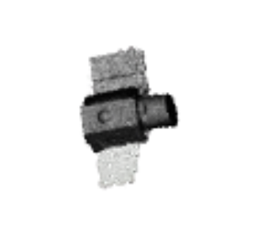

## 8.13 周报

### 1. QPS-SAR

- 基于原始 OBJ 模型拟合天线圆心与法线，建立天线局部坐标系

- 划分固定组件和运动伞面，完成闭合、半开和完全展开三种状态的制作，优化伞面与伞骨连接处

- 导出三个材质统一的独立 OBJ 模型

### 2. 论文代码复现

- 连上了实验室的服务器，开始完整的跑师兄的代码
- SuperGlue-关键点匹配

​	**跑了Aura**

​	**Cartography**

​	**ISAR**

​	**TG1**

---

- **SVD**

  **稀疏点云重建**，它只重建特征点位置，不会像第三章 GaussianObject 那样生成高质量、连续、可渲染的 3D 物体表面，更像是论文第二章里的几何基础验证或前置实验

---

- **GaussianObject**

  **第三章 GaussianObject 复现流程**，主要包括 Visual Hull、Coarse 3DGS、Leave-One-Out、LoRA Fine-Tuning 和 Gaussian Repair。整体思路是先根据少量视角得到一个粗糙三维模型，再利用图像修复模型逐步提升渲染质量

  本周主要跑通了官方 kitchen 案例的前后流程，并把流程迁移到 T3 数据上

---

- **Kitchen：Visual Hull**

  可视外壳重建，先利用 mask 和相机信息恢复一个粗糙的三维外壳，作为后续 3D Gaussian 模型的初始几何基础

---

- **Kitchen：Coarse 3DGS**

  粗糙三维高斯泼溅模型训练，用 Visual Hull 得到的粗糙外壳作为初始点云，训练一个初始可渲染的 Gaussian Splatting 模型

---

- **Kitchen：粗糙模型渲染**

  对训练出的粗糙 3DGS 模型进行渲染，并与真实图像进行对比。当前渲染图和真实图之间仍有明显差距，说明后续还需要 LoRA 微调和 Gaussian Repair 继续修复

---

- **Kitchen：Leave-One-Out**

  **留一法分析**，每次故意去掉一个输入视角，只用剩余视角训练粗糙三维高斯模型，再观察模型在缺失视角上的表现，用来构造“粗糙渲染图 - 真实图像”的训练配对数据

  结果中生成了 leave_14、leave_70、leave_171、leave_196 等多组实验目录，每组对应一次留掉特定视角后的训练结果

---

- **Kitchen：LoRA Fine-Tuning**

  **低秩适配微调**，利用留一法生成的“粗糙渲染图 - 真实图像”配对数据，微调图像修复模型，让模型学习如何把粗糙三维模型渲染出的图像修复得更接近真实图

  这一部分当前主要完成了训练流程的整理和运行准备，暂时没有单独的结果图

---

- **Kitchen：Gaussian Repair**

  **高斯修复**，使用 LoRA 微调后的修复模型反过来优化粗糙三维高斯模型，得到质量更高的最终三维表示和渲染结果

---

- **T3：数据迁移准备**

  **真实数据迁移**，检查 T3 数据后发现它已经包含 dust3r_4.json、dust3r_4.ply、sparse_4.txt、sparse_test.txt、images 和 masks 等文件，因此不需要重新生成 Visual Hull，可以直接使用 dust3r_4.ply 作为初始点云进行迁移实验

  这一部分主要是数据检查和流程判断，暂时没有单独的结果图

---

- **T3：Coarse 3DGS 粗糙三维高斯模型训练**

  直接基于 dust3r_4.ply 初始化点云，训练 T3 数据对应的粗糙 Gaussian Splatting 模型

---

- **T3：粗糙模型渲染**

  对训练好的 T3 粗糙 3DGS 模型进行渲染，用来观察迁移到真实数据后的初步重建效果

---

- **T3：Leave-One-Out 留一法分析**

  在 T3 数据上继续进行留一法实验，目的是生成真实数据下的“粗糙渲染图 - 真实图像”配对，为后续 LoRA 微调和 Gaussian Repair 做准备

---

- **T3：LoRA Fine-Tuning 低秩适配微调**

- **T3：Gaussian Repair 高斯修复**

  用 T3 微调后的修复模型优化粗糙三维高斯模型，得到最终修复后的 T3 三维重建结果感觉质量没有kitchen的好

### 3.下周计划：

- 继续跑通论文剩余部分的代码
- 对比 kitchen 官方案例和 T3 数据的重建效果，分析真实数据迁移后渲染质量下降的原因
- 根据代码和实验结果加深和补充论文中相关方法的理解和学习