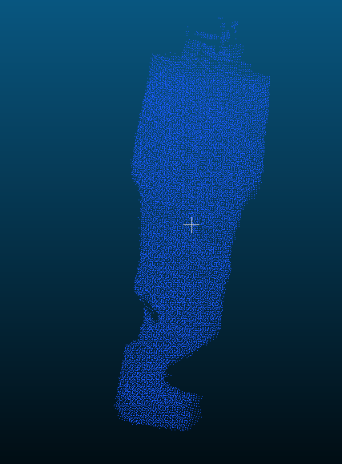

## 8.20 周报

### 1. 论文代码复现

- 本周继续复现李冬程师兄论文后续代码，重点跑第四章 TurboReg 点云配准部分

- 跑通了 TurboReg 官方 demo，将源点云和目标点云导出为 ply 文件，并在 CloudCompare 中查看配准效果

- 整理了目前已经跑过的代码流程，大致可以串成：SuperGlue 图像匹配、SVD 稀疏三维重建、GaussianObject 少视角三维重建、二维 mask 到三维点云语义投票、TurboReg 点云配准

- 进一步理解了语义分割部分，当前代码主要是把已有二维 mask 投影到三维点云上进行投票，还没有完整复现论文里的关键点引导 SAM

- 对比了 SVD 和 DUSt3R 的作用，SVD 更像传统几何方法，用匹配点和矩阵分解得到稀疏点云；DUSt3R 是深度学习三维重建方法，在代码中主要用于真实数据的相机位姿估计和初始点云生成

- 阶段性总结了论文和代码之间的差距：GaussianObject 使用的是已有 mask，语义分割目前更像 mask 投影验证，TurboReg 官方代码可以跑通，但论文中改进 ICP 或图置信度加权部分还需要继续确认

### 2. 下周计划

- 了解更多三维重建相关方法，模型

- 读3DGS以及其他相关论文
