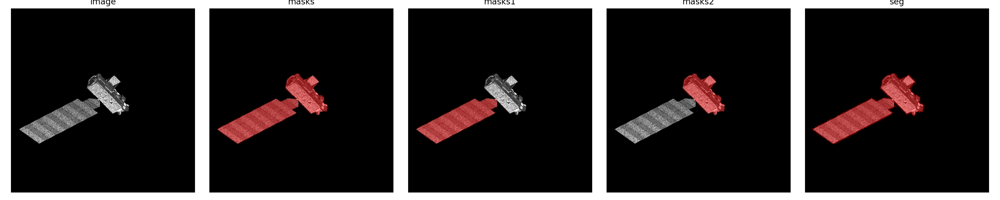

## 8.6 周报

### 1. 论文代码复现

- 本周继续复现李冬程师兄论文中的后续代码，重点学习二维图像匹配结果、二维分割 mask 与三维点云之间的关系
  
- 跑通了二维点到三维点云的最小重建流程，生成了三维点云 .ply 文件和可视化预览图
  
- 理解了当前最小重建代码中相机内参和相对位姿的来源，跑这部分代码目前使用的是已有相机参数，而不是从匹配结果中完整估计得到

- 学习了二维分割 mask 的含义，区分了整体目标 mask 和部件级 mask，理解了已有 mask 可视化结果中原图、灰度 mask 和叠加图的含义

- 自己的电脑跑不动，尝试使用 SAM 进行单张图像分割推理，理解了当前运行的是预训练模型推理，不是重新训练 SAM 模型

  

- 跑通了二维 mask 到三维点云标签的投影投票流程，将二维前景 mask 投影到三维点云上

### 2. 下周计划

- 继续查找 Aura 数据对应的三维点云和相机参数文件，尝试完成 Aura 二维部件标签到三维点云部件标签的完整流程
  
- 继续学习相机内参、外参、相对位姿和三角化重建的关系，进一步理解 SuperGlue 匹配结果如何用于三维重建
  
- 继续尝试使用 SAM 或已有部件 mask 生成更准确的二维部件标签，为后续三维点云部件分割实验做准备
  
- 整理当前已经跑通的代码流程和输出文件，明确哪些部分属于完整复现，哪些部分仍然依赖已有参数或已有标注，后续考虑用服务器实现代码的完整复现
